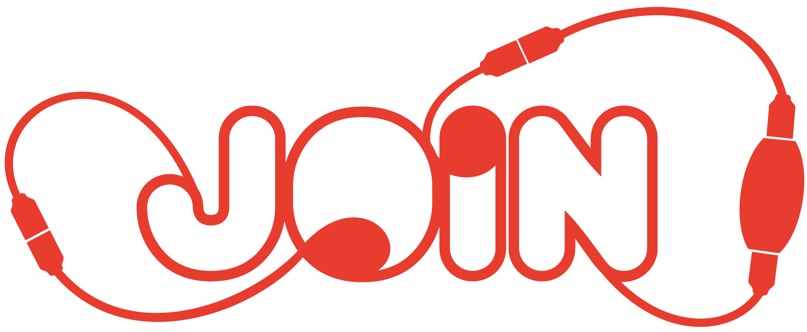

<h1>
    <div align="center">
        
    </div>
</h1>

JOIN wich stands for "**Jo**rnadas de **In**formática" is a Job Shop aimed at students in the field of computing.

It's an annual event that aims to promote interaction between students from the three study cycles of this university with a strong IT component and the business world, regional or national, which has been its major employer.

## Getting started

To get started with this template, first install the npm dependencies:

```bash
npm install
```

Next, run the development server:

```bash
npm run dev
```

Finally, open [http://localhost:3000](http://localhost:3000) in your browser to view the website.

## Customizing

You can start editing this template by modifying the files in the `/src` folder. The site will auto-update as you edit these files.

## License

This site template is a commercial product and is licensed under the [Tailwind UI license](https://tailwindui.com/license).

## Learn more

To learn more about the technologies used in this site template, see the following resources:

- [Tailwind CSS](https://tailwindcss.com/docs) - the official Tailwind CSS documentation
- [Next.js](https://nextjs.org/docs) - the official Next.js documentation
- [Headless UI](https://headlessui.dev) - the official Headless UI documentation
